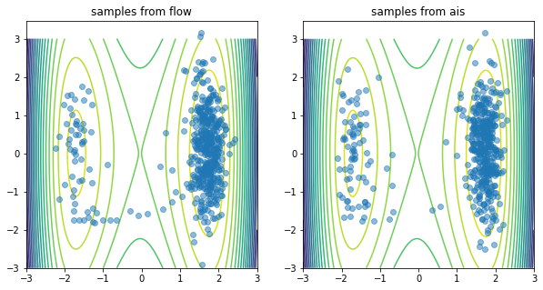
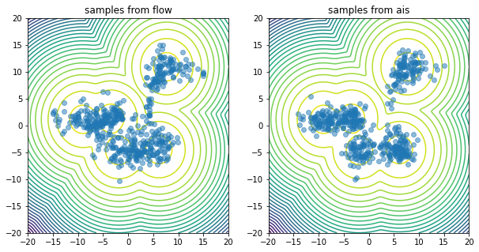

# Flow Annealed Importance Sampling Boostrap (FAB) implementation in JAX
See corresponding paper [here](https://arxiv.org/abs/2111.11510).

## Install
```
pip install git+https://github.com/lollcat/fab-jax.git
```

## Examples
**Double Well Boltzmann distribution samples vs contours** (see [notebook](examples/double_well.ipynb))


**Gaussian Mixture Model samples vs contours** (see [notebook](examples/gmm.ipynb))
